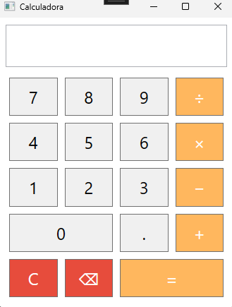

# PAC 4 – Calculadora WPF

## 📝 Descripció Breu
Aplicació de Windows Presentation Foundation (WPF) que implementa una calculadora amb operacions bàsiques, expressions encadenades, gestió de decimals segons cultura local i control d’errors.

## 👤 Autor i ⚖️ Llicència
**Autor:** Biel Reniu Valdés  
**Llicència:** MIT License

## 📑 Índex
- [🌐 Requisits del Sistema](#-requisits-del-sistema)  
- [✨ Funcionalitats Principals](#-funcionalitats-principals)  
- [🚀 Guia d’Instal·lació](#-guia-dinstal·lació)  
- [⚙️ Guia d’Ús](#-guia-dús)  
- [💡 Exemples d’Ús](#-exemples-dús)  
- [🎨 Estils](#-estils)  
- [📸 Captures de Pantalla](#-captures-de-pantalla)  
- [📝 Conclusions](#-conclusions)

## 🌐 Requisits del Sistema
- .NET 6.0 SDK o superior  
- Windows 10/11  
- Visual Studio 2022 (recomanat)

## ✨ Funcionalitats Principals
- **Operacions bàsiques:** suma (+), resta (−), multiplicació (×), divisió (÷)  
- **Expressions encadenades:** precedència correcta d’operadors  
- **Decimals:** suport segons cultura local  
- **Correcció d’entrada:** botons ⌫ (Backspace) i C (Clear)  
- **Gestió d’errors:** divisió per zero i sintaxi invàlida  
- **Estils:** colors diferenciats per dígits, operadors i accions d’avís

## 🚀 Guia d’Instal·lació
```bash
git clone <URL-del-repositori>
cd PAC_4___Calculadora
```  
1. Obre la solució `PAC_4___Calculadora.sln` a Visual Studio.  
2. Prem **Build Solution** per compilar.

## ⚙️ Guia d’Ús
1. Executa l’aplicació des de Visual Studio (F5) o amb un doble clic a l’executable.  
2. Introdueix nombres, operadors i punt decimal.  
3. Prem `=` per avaluar l’expressió i veure el resultat.  
4. Prem `⌫` per eliminar l’últim caràcter o `C` per reiniciar tot el càlcul.

## 💡 Exemples d’Ús
| Expressió          | Resultat               |
|--------------------|------------------------|
| `9 × 9 − 3 =`      | 78                     |
| `5 + 3 * 2 =`      | 11                     |
| `5 / 2 =`          | 2,5                    |
| (després) `× 4 =`  | 10                     |
| `8 ÷ 0 =`          | Error: Divisió per zero |
| Sintaxi `+5 =`     | Error                  |

## 🎨 Estils
Els estils estan definits al XAML dins `<Window.Resources>`:
```xml
<Style x:Key="DigitButton" TargetType="Button">
  <Setter Property="Background" Value="#F0F0F0"/>
  <Setter Property="Foreground" Value="Black"/>
</Style>
<Style x:Key="OperatorButton" TargetType="Button">
  <Setter Property="Background" Value="#FFB75E"/>
  <Setter Property="Foreground" Value="White"/>
</Style>
<Style x:Key="WarningButton" TargetType="Button">
  <Setter Property="Background" Value="#E74C3C"/>
  <Setter Property="Foreground" Value="White"/>
</Style>
```

## 📸 Captures de Pantalla
### Interfície inicial


### Error per divisió per zero


### Error de sintaxi invàlida


## 📝 Conclusions
Aquest projecte ha mostrat:
- Separació neta entre la vista (XAML) i la lògica (C#).  
- Ús de `DataTable.Compute` per processar expressions amb precedència.  
- Adaptació de la interfície a la cultura local per decimals.  
- Gestió proactiva d’errors per a millor experiència d’usuari.

**MIT © Biel Reniu Valdés**
